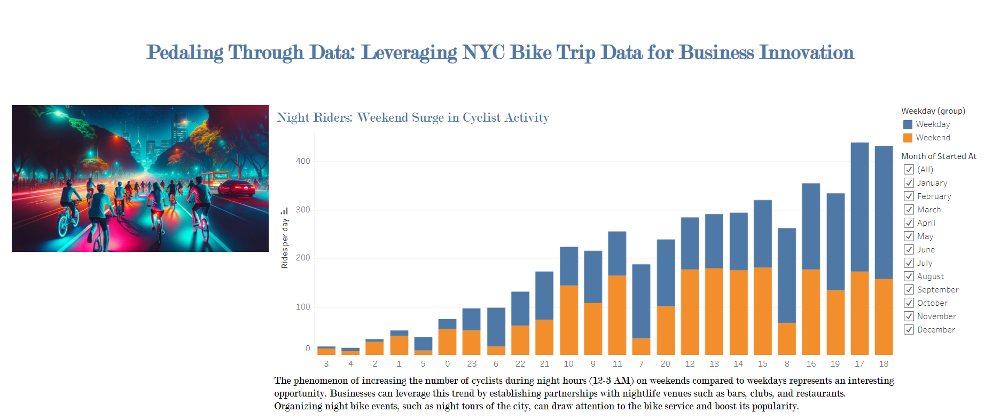

# Jersey City Bike Insights

## Overview

The "Jersey City Bike Insights" project is a comprehensive analysis and visualization of CitiBike usage data in Jersey City from 2022 to 2024. This project leverages Tableau Public to create interactive dashboards that provide insights into various aspects of the bike-sharing program.

### Purpose

The purpose of this project is to provide stakeholders, including city officials and the general public, with a clear and interactive way to understand the usage patterns and trends of the CitiBike program in Jersey City. By visualizing this data, the decision-making process can be improved. The discovery of unexpected phenomena, such as the increase in the number of cyclists during night hours (12-3 AM) on weekends compared to weekdays, presents new opportunities for business partnerships and marketing campaigns.



### Data source selection

https://citibikenyc.com/system-data provides data both for New York City and Jersey City. Initial data analysis discovered that NYC data for recent years is too big, 3-4M of records per month, therefore even a few months of data exceeds Tableau Public limits of 15M records. Such limitation does not allow to discover seasonal patterns and stations popularity over years (which is one of the requirements).

That is why the alternative was choosen, CitiBike data for Jersey City. It contains far less records, which enables analytics for a few recent years. Further data discovery revealed that format of files was changed in January 2022, therefore the decision was to analyze Jersey City data from January 2022 forward.

### Scope

The scope of this project includes:

- **Data Collection and Preparation:**
  - Data collection, cleaning, and preparation.
  - Creation of interactive visualizations.

- **Analysis of Ride Frequency and Patterns:**
  - Examination of usage trends over different times of the day and week.
  - Insights into user demographics and trip durations.
  - Identification of popular routes and stations.

- **Notable Trends:**
  - **Docked Bikes:** 
    - Used exclusively by casual users for long, leisurely rides in parks and recreational areas.
  - **Night Rides:**
    - Significant increase in night rides on weekends compared to weekdays.
    - Opportunities for partnerships with recreational areas and nightlife venues to promote bike rentals.

- **Riding Habits:**
  - **Casual Cyclists:**
    - More active during leisure hours on weekends.
  - **Member Cyclists:**
    - Primarily use bikes for commuting on weekdays.
  
- **Seasonal Fluctuations:**
  - Trip numbers show seasonal variations.
  - Increasing popularity of waterfront stations in summer.

- **Strategic Opportunities:**
  - Popular stations near transportation hubs (e.g., Grove St Path, Hoboken Terminal).
  - Potential partnerships with ferry operators and local businesses.
  - Infrastructure improvements, targeted marketing campaigns, and comprehensive transport packages to enhance the CitiBike program's appeal and utility.

### Objectives

The objectives of this project are:

- **Provide Clear and Interactive Visualizations:**
  - Enable stakeholders, including city officials and the general public, to understand usage patterns and trends of the CitiBike program in Jersey City.

- **Support Decision-Making Processes:**
  - Facilitate urban transportation planning and policy development through data-driven insights.

- **Identify Key Usage Trends:**
  - Analyze phenomena such as the increase in night rides on weekends and the exclusive use of docked bikes by casual users.

- **Enhance Business Partnerships:**
  - Leverage insights to form strategic partnerships with parks, botanical gardens, nightlife venues, ferry operators, and local businesses.

- **Improve User Experience:**
  - Develop targeted marketing campaigns and comprehensive transport packages.
  - Enhance infrastructure with additional bike parking and service points.

## Main Components of the Project

1. **Tableau Public Dashboards**:
    - The main visualization is available at the link: [CitiBike in Jersey City (2022-2024)](https://public.tableau.com/views/CitiBike-Jersey_City_Insights/CitiBikeinJerseyCity2022-2024)

2. **HTML Page**:
    - The main page of the project - `index.html`: contains a reference to the report hosted in Tableau Public

3. **Jupyter Notebook**:
    - Data preparation notebook `Data preparation.ipynb`:
    - Consolidation of 29 original files into a single CSV file to improve performance of Tableau
    - Removing any trips that are below 60 seconds in length (potentially false starts or users trying to re-dock a bike to ensure it's secure)
    - Removing any trips that have either negative or above 50 mph average speed, because such records have data issues

## Technologies Used

- **Tableau Public**: for creating interactive visualizations.
- **Jupyter Notebook**: for data preparation.
- **HTML/CSS**: for creating the main web page of the project.

### Prerequisites

- Python 3.x installed on your machine.
- Basic knowledge of Git and command line operations.
- An internet connection to view the Tableau Public dashboard.

### Installation Steps

1. **Clone the Repository**:
    ```bash
    git clone https://github.com/NataliiaShevchenko620/tableau-challenge.git
    cd tableau-challenge
    ```

2. **Run the Local Server to Display the HTML Page**:
    ```bash
    python -m http.server
    ```
    Open your browser and go to `http://localhost:8000`.

3. **View Visualizations in Tableau Public**:
    Go to the Tableau Public link to see the interactive dashboards.

## Project Structure

The project directory structure is as follows:

```Jersey Bike Insights/
Jersey Bike Insights/
├── Resources/
│   ├── Data preparation.ipynb
│   ├── JC-citibike-tripdata.zip
│   ├── data_JC/
│   │   ├── JC-202201 to JC-202212-citibike-tripdata.csv # Monthly data for 2022
│   │   ├── JC-202301 to JC-202312-citibike-tripdata.csv # Monthly data for 2023
│   │   ├── JC-202401 to JC-202405-citibike-tripdata.csv # Monthly data for January to May 2024
├── index.html
├── README.md
├── Tableau.png
├── Analysis/
│   ├── CitiBike-Jersey_City_Insights.twbx
│   ├── night_cycling.jpg


```


### Getting Detailed Information

To get detailed information and insights, open the `index.html` file in a web browser. This will display the main dashboard, which provides interactive visualizations and insights into the CitiBike usage data in Jersey City.
[See more details on the website]( https://nataliiashevchenko620.github.io/tableau-challenge/)

## License

This project is licensed under the MIT License. See the LICENSE file for details.


